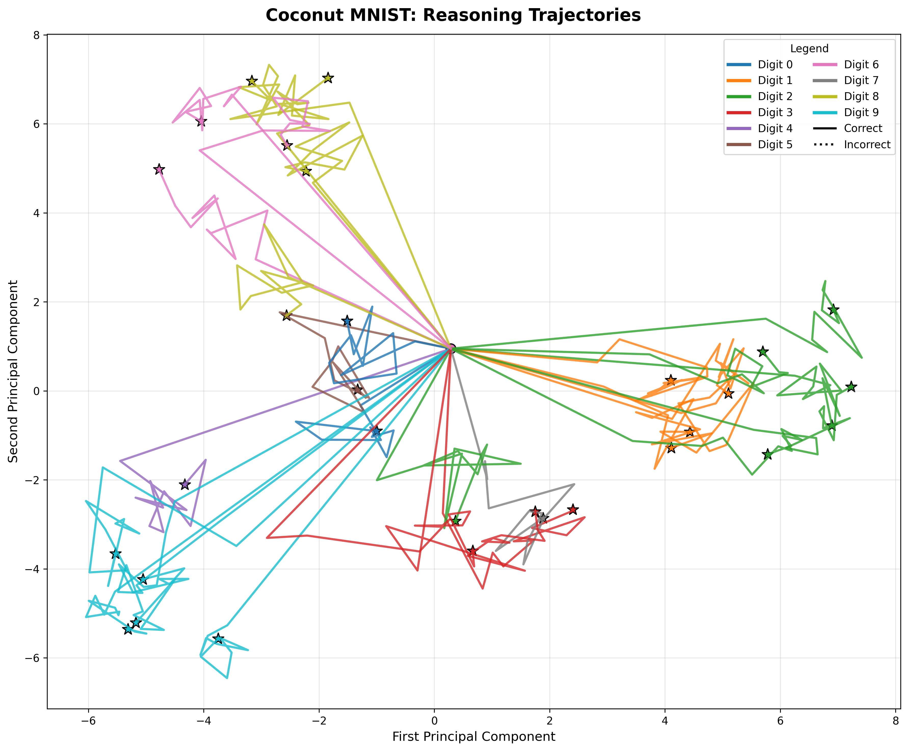

# coconut-tree

A simple set of experiments with Meta's "COCONUT" paradigm (Continuous "chain-of-thought"). This project implements both a baseline Vision Transformer for MNIST classification and an enhanced version using the COCONUT continuous reasoning approach.

## Overview

The COCONUT (Continuous Chain-of-Thought) paradigm allows models to perform reasoning in continuous latent space rather than through discrete token sequences. This eliminates the tokenization bottleneck and enables more fluid reasoning processes.

## Project Structure

- `train_mnist_simple.py` - Baseline Vision Transformer implementation and training
- `mnist_coconut.py` - COCONUT architecture adapted for MNIST classification
- `train_mnist_coconut.py` - Training script for COCONUT model with comparison capabilities
- `visualize_coconut_reasoning.py` - Visualization tool for COCONUT reasoning trajectories
- `data/` - Directory for MNIST dataset files
- `mnist_attention_checkpoint/` - Saved baseline Vision Transformer model
- `mnist_coconut_checkpoint/` - Saved trained COCONUT model

## Features

### Simple MNIST Classifier (Vision Transformer)

A standard Vision Transformer implementation for MNIST digit classification:
- Patch-based image encoding (4x4 patches)
- Multi-head attention mechanism
- Transformer blocks with layer normalization
- Classification head for 10-digit prediction

### COCONUT MNIST Classifier

An enhanced version that implements continuous reasoning:
- **Continuous Latent Reasoning**: Uses hidden states directly as embeddings without tokenization
- **Autoregressive Reasoning Loop**: Iteratively refines latent thoughts
- **Multi-step Classification**: Generates predictions through reasoning steps
- **Flexible Architecture**: Can operate in both standard and reasoning modes

## Usage

### 1. Prepare MNIST Data

Download MNIST dataset files and place them in the `data/mnist/` directory:
- `train-images.idx3-ubyte`
- `train-labels.idx1-ubyte`
- `t10k-images.idx3-ubyte`
- `t10k-labels.idx1-ubyte`

### 2. Train Baseline Vision Transformer

```bash
python train_mnist_simple.py --data_path data --save_path mnist_attention_checkpoint --epochs 10
```

### 3. Train COCONUT Model

```bash
# Train with COCONUT reasoning (default)
python train_mnist_coconut.py --model_path mnist_attention_checkpoint --data_path data --save_path mnist_coconut_checkpoint --epochs 5 --reasoning_steps 10

# Train regular model for comparison
python train_mnist_coconut.py --model_path mnist_attention_checkpoint --data_path data --save_path mnist_regular_checkpoint --epochs 5 --use_regular
```

### 4. Test COCONUT Model

```python
from mnist_coconut import load_trained_coconut_model
import torch

# Load trained COCONUT model
model, config = load_trained_coconut_model("mnist_coconut_checkpoint")

# Generate predictions with reasoning
images = torch.randn(1, 1, 28, 28)  # Dummy image
predictions, reasoning_logits = model.generate(images, max_reasoning_steps=10)
```

### 5. Visualize COCONUT Reasoning

```bash
# Visualize reasoning trajectories with ground truth density regions
python visualize_coconut_reasoning.py --model_path mnist_coconut_checkpoint --num_images 30

# Use PCA or t-SNE for dimensionality reduction
python visualize_coconut_reasoning.py --reduction_method tsne --num_images 50
```

## Arguments

### train_mnist_simple.py
- `--data_path`: Path to MNIST data directory (default: "data")
- `--save_path`: Path to save model (default: "mnist_attention_checkpoint")
- `--epochs`: Number of training epochs (default: 10)
- `--batch_size`: Batch size (default: 64)
- `--lr`: Learning rate (default: 1e-3)

### train_mnist_coconut.py
- `--model_path`: Path to pretrained Vision Transformer (default: "mnist_attention_checkpoint")
- `--data_path`: Path to MNIST data (default: "data")
- `--save_path`: Path to save COCONUT model (default: "mnist_coconut_checkpoint")
- `--epochs`: Number of epochs (default: 3)
- `--batch_size`: Batch size (default: 32)
- `--lr`: Learning rate (default: 1e-4)
- `--reasoning_steps`: Number of reasoning steps (default: 10)
- `--use_coconut`: Use COCONUT reasoning (default: True)
- `--use_regular`: Use regular training instead of COCONUT

### visualize_coconut_reasoning.py
- `--model_path`: Path to trained COCONUT model (default: "mnist_coconut_checkpoint")
- `--data_path`: Path to MNIST data (default: "data")
- `--num_images`: Number of images to analyze (default: 10)
- `--max_reasoning_steps`: Max coconut reasoning steps (default: 10)
- `--reduction_method`: Dimensionality reduction method - 'pca' or 'tsne' (default: 'pca')
- `--seed`: Random seed for reproducibility (default: 42)
- `--save_path`: Output plot path (default: "coconut_reasoning.png")

## Key Differences: Standard vs COCONUT

| Feature | Standard ViT | COCONUT ViT |
|---------|-------------|-------------|
| Reasoning | Single forward pass | Multi-step continuous reasoning |
| Latent Updates | Static embeddings | Dynamic latent thought evolution |
| Output | Direct classification | Reasoning sequence + classification |
| Training | Standard cross-entropy | Reasoning-aware loss |
| Inference | Fast single pass | Interpretable reasoning steps |

## Dependencies

- PyTorch
- NumPy
- matplotlib (for visualization)
- scikit-learn (for PCA and t-SNE)
- scipy (for kernel density estimation)
- tqdm (for progress bars)
- Standard Python libraries (os, struct, argparse)

## Model Architecture Details

### Vision Transformer Components
- **Patch Embedding**: Converts 28x28 images into 7x7 grid of 4x4 patches
- **Multi-Head Attention**: 4 attention heads with 64-dimensional embeddings
- **Transformer Blocks**: 4 layers with layer normalization and GELU activation
- **Classification Head**: Linear layer for 10-class digit prediction

### COCONUT Enhancements
- **Special Tokens**: Latent, start, and end tokens for reasoning sequences
- **Continuous Reasoning**: Hidden states directly become next embeddings
- **Latent Update Module**: Optional transformation for thought refinement
- **Extended Positional Embeddings**: Support for variable-length reasoning

## Experimental Results

The COCONUT model demonstrates the ability to perform multi-step reasoning for MNIST classification, providing interpretable reasoning steps while maintaining competitive accuracy with the baseline Vision Transformer.

## Visualization Features

The `visualize_coconut_reasoning.py` script provides powerful insights into the COCONUT reasoning process:

### Reasoning Trajectory Visualization
- **2D Embedding Space**: Uses PCA or t-SNE to project high-dimensional reasoning states to 2D
- **Step-by-Step Progression**: Shows how reasoning evolves from initial image embeddings to final predictions
- **Ground Truth Density Regions**: Displays where correctly classified examples typically converge for each digit class
- **Hit vs Miss Analysis**: Distinguishes successful reasoning paths (solid lines) from failures (dotted lines)

### Key Visualization Elements
- **Colored Density Regions**: Each digit (0-9) has its own colored convergence zone based on correct predictions
- **Reasoning Trajectories**: Lines showing the autoregressive reasoning path from start to finish
- **Digit Labels**: Clear numerical labels marking the center of each ground truth region
- **Start/End Markers**: Circles mark reasoning start points, stars mark successful endpoints

### Interpretability Benefits
- **Continuous Reasoning Analysis**: Observe how latent thoughts evolve without tokenization bottlenecks
- **Convergence Patterns**: See which reasoning paths lead to correct vs incorrect predictions
- **Spatial Organization**: Understand how the model organizes different digit concepts in embedding space
- **Reasoning Quality**: Assess whether reasoning trajectories align with expected ground truth regions

This visualization framework enables researchers to gain deep insights into how COCONUT models perform continuous reasoning and make predictions in latent space.



*Example visualization showing COCONUT's autoregressive reasoning trajectories in 2D embedding space. Each colored region represents where correctly classified examples of each digit typically converge, while the trajectories show the step-by-step reasoning process from initial embeddings to final predictions.*